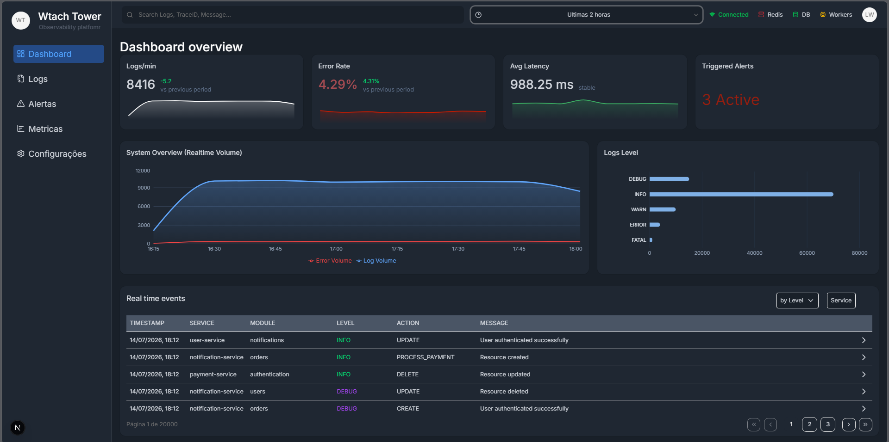
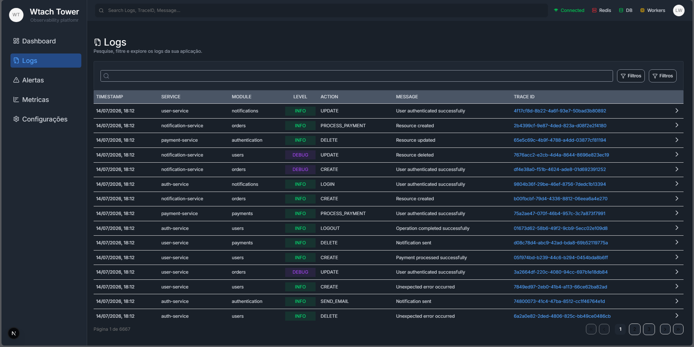
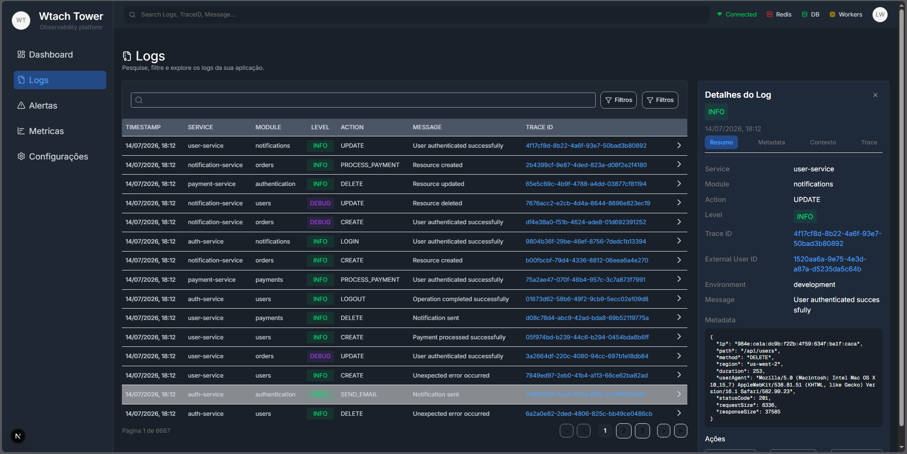

# Watchtower 🔭

Plataforma de observabilidade Full Stack para centralização de logs, monitoramento de métricas em tempo real e processamento assíncrono de eventos — desenvolvida como laboratório prático de conceitos avançados de backend e infraestrutura de software.

---

## 📸 Visão Geral do Sistema (Em desenvolvimento)

> ## Dashboard em tempo real.

Painel principal com resumo de logs por minuto, latência média e logs cadastrados.

* Visão geral da situação do sistema.
* Atualizações em tempo real.

<p align="center">
  
</p>

> ## Logs.

Painel voltado para verificar detalhes de cada log registrado.

* Listagem de todos os logs.
* Vizualização mais detalhada de cada log.

<p align="center">
  
</p>

<p align="center">
  
</p>

---

## ✅ O que já está funcionando

- **Ingestão e centralização de logs** — recebimento, classificação e persistência de logs de múltiplas origens
- **Dashboard com métricas em tempo real** — visualização atualizada de eventos e indicadores operacionais
- **Processamento assíncrono com BullMQ** — filas de eventos com workers dedicados e retry automático
- **Autenticação segura** — Dual Token Pattern com Access Token em memória e Refresh Token via Cookie HttpOnly
- **Idempotência em operações críticas** — prevenção de duplicidade em requisições de escrita
- **Painel de usuário** — interface administrativa para visualização e gestão

---

## 🧠 Principais Conceitos Trabalhados

### Processamento Assíncrono com BullMQ
Eventos e logs são processados de forma assíncrona por meio de filas gerenciadas com BullMQ e Redis, desacoplando a ingestão do processamento e garantindo resiliência em cenários de alta carga.

- Workers dedicados por tipo de evento
- Retry automático em caso de falha
- Filas priorizadas para eventos críticos

### Ingestão e Centralização de Logs
O sistema recebe logs de diferentes origens via API e os centraliza para consulta, filtragem e análise.

- Classificação por nível (info, warn, error, debug)
- Persistência estruturada no PostgreSQL
- Consultas otimizadas com filtros por origem, nível e intervalo de tempo

### Métricas em Tempo Real
O dashboard exibe métricas operacionais atualizadas continuamente, permitindo visibilidade sobre o comportamento do sistema.

### Autenticação e Segurança

**Dual Token Pattern**

O sistema utiliza:
- Access Token armazenado em memória no cliente
- Refresh Token via Cookie HttpOnly

Essa abordagem reduz a exposição do JWT em cenários de XSS e mantém sessões seguras sem depender de localStorage.

**Idempotência**

Operações de escrita utilizam chaves de idempotência para evitar duplicações causadas por cliques múltiplos, falhas de conexão ou reenvio acidental de requisições.

> **Trade-off atual:** as chaves são armazenadas em memória no servidor durante o MVP, reduzindo complexidade operacional. A evolução planejada é migrar para Redis compartilhado em ambientes distribuídos.

---

## 🛠️ Stack Tecnológica

**Backend**
- Node.js
- NestJS
- TypeScript
- PostgreSQL
- Prisma ORM
- Redis
- BullMQ
- JWT / Bcrypt

**Frontend**
- Next.js
- TypeScript
- Tailwind CSS

---

## 📂 Estrutura Geral do Projeto

```
watchtower/
├── api/
│   ├── src/
│   │   ├── modules/
│   │   │   ├── logs/
│   │   │   ├── enterprise/
│   │   │   └── auth/
│   │   ├── shared/
│   │   ├── guards/
│   │   └── prisma/
│
├── frontend/
│   ├── src/
│   │   ├── app/
│   │   ├── components/
│   │   ├── hooks/
│   │   └── services/
```

---

## 🚀 Como Executar o Projeto

### Pré-requisitos
- Node.js v18+
- PostgreSQL
- Redis

### Backend

```bash
# Clone o repositório
git clone https://github.com/LucasWar/watchtower.git

# Entre na pasta do backend
cd watchtower/api

# Instale as dependências
npm install

# Configure as variáveis de ambiente
cp .env.example .env

# Execute as migrations
npx prisma migrate dev

# Inicie o servidor
npm run start:dev
```

### Frontend

```bash
cd ../frontend

npm install

npm run dev
```

---

## ⚠️ Status Atual do Projeto

O Watchtower está em **desenvolvimento ativo**. Funcionalidades core já estão implementadas, com pontos planejados de evolução:

- Cobertura de testes (unitários e E2E)
- Observabilidade com OpenTelemetry / Grafana
- WebSockets para atualizações em tempo real sem polling
- Migração da idempotência para Redis distribuído
- Docker Compose completo
- Deploy automatizado com CI/CD

---

## 📌 Decisões Técnicas e Trade-offs

| Decisão | Escolha | Motivo |
|---|---|---|
| Filas de eventos | BullMQ + Redis | Maturidade, suporte a retry e prioridade de filas |
| Armazenamento de idempotência | Memória (MVP) | Simplicidade operacional; Redis planejado para produção |
| Autenticação | Dual Token Pattern | Reduz exposição a XSS sem sacrificar UX |
| ORM | Prisma | Tipagem forte, migrations e DX no ecossistema TypeScript |

---

## 🔮 Melhorias Futuras

- Integração completa com Redis para idempotência distribuída
- Alertas automáticos por threshold de métricas
- Suporte a múltiplas origens de log via SDK
- Notificações em tempo real via WebSockets
- Testes E2E completos
- Observabilidade com Grafana + OpenTelemetry
- Docker Compose completo para setup local simplificado

---

## 📚 Objetivos do Projeto

Desenvolvido para aprofundar conhecimentos em:

- Arquitetura de sistemas orientados a eventos
- Processamento assíncrono com filas
- Observabilidade e monitoramento
- Segurança em autenticação (JWT, HttpOnly, XSS)
- Infraestrutura backend com Redis
- Boas práticas com TypeScript e NestJS

---

## 📄 Licença

Projeto desenvolvido para fins de estudo, portfólio e evolução técnica.